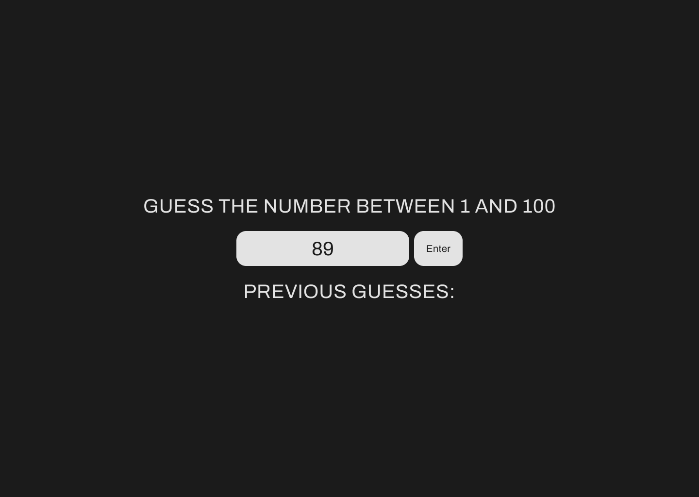

# Guess the Number

---

[Play]()

Guess the number between 1 and 100.

# Wireframes and Planning

---

[Figma](https://www.figma.com/file/6Grtxd5KqO7w96DDjpxOTQ/Untitled?type=design&node-id=0%3A1&mode=design&t=9jvYKIi5V4RE11Gh-1)

# Screenshots

---

# Technology Used

---

